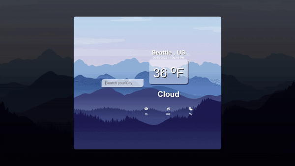

# Weather-Dashboard
I WANT check the weather in any city in the world

WHEN i enter the name of the city i want to see

THEN website displays the weather information of that city

Required information: city, country, temperature, weather, visibility, wind speed,humidity
# Image

# Link
Github: https://github.com/minhkhoinguy/Weather-Dashboard

Webpage: https://minhkhoinguy.github.io/Weather-Dashboard/